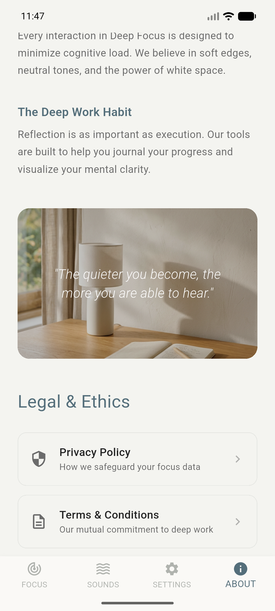
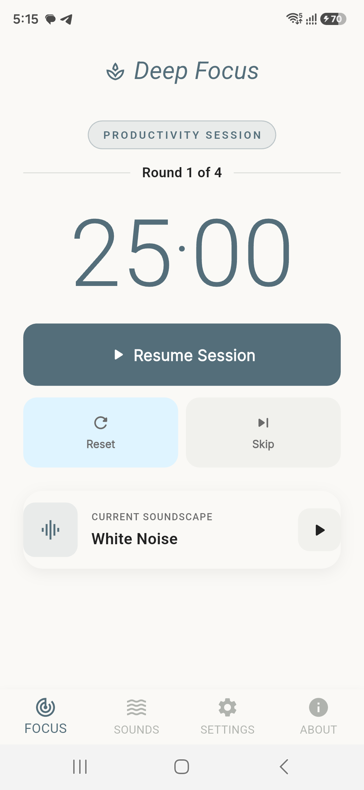
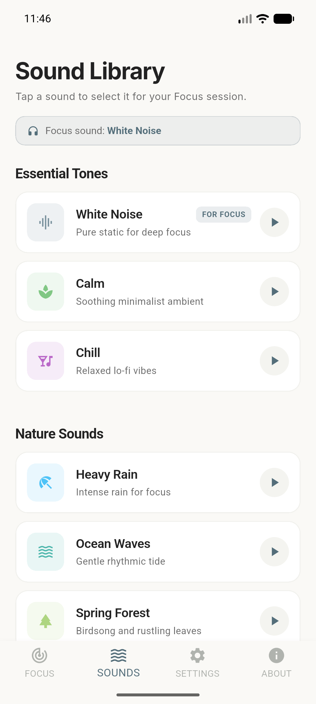
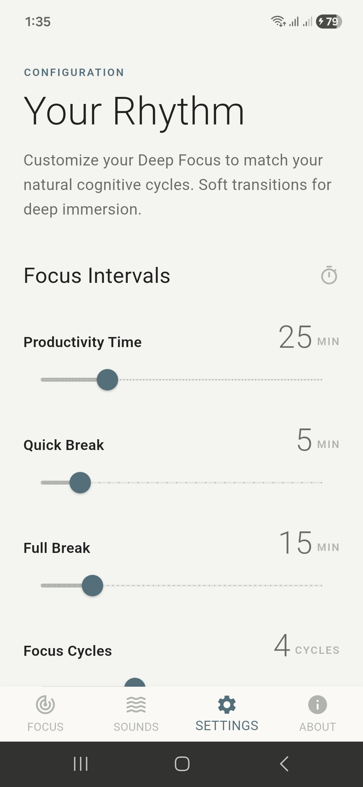

# 🧘 Deep Focus

[](https://flutter.dev)
[](https://dart.dev)
[](https://pub.dev/packages/provider)
[](https://opensource.org/licenses/MIT)

**Deep Focus** is a premium, minimalist productivity companion built with Flutter. Inspired by calm, Scandinavian-Japanese (**Japandi**) design philosophies, it blends high-precision interval timing with multi-layered, looping background soundscapes to help developers and creatives enter, sustain, and exit high-cognitive-load flow states.

---

## 📱 Visual Showcase

<div align="center">
  <p><i>Experience a highly polished, responsive interface crafted with micro-interactions, responsive sizing, and elegant glassmorphism.</i></p>
  <table style="width: 100%; border: none; border-collapse: collapse;">
    <tr style="border: none;">
      <td align="center" style="width: 25%; border: none; padding: 8px;">
        <p><b>✨ Elegant Splash</b></p>
        
      </td>
      <td align="center" style="width: 25%; border: none; padding: 8px;">
        <p><b>🕒 Focus Timer</b></p>
        
      </td>
      <td align="center" style="width: 25%; border: none; padding: 8px;">
        <p><b>🎵 Ambient Library</b></p>
        
      </td>
      <td align="center" style="width: 25%; border: none; padding: 8px;">
        <p><b>⚙️ Custom Settings</b></p>
        
      </td>
    </tr>
  </table>
</div>

---

## ⚡ Core Features (1-Minute Overview)

*   **🕒 Custom Pomodoro engine:** Fluid transition cycles between **Productivity**, **Quick Breaks**, and **Full Breaks** based on custom round lengths.
*   **🎵 Integrated Soundscape Mixer:** High-fidelity, gapless looped audio player powered by `just_audio` (Rain, Forest, White Noise, etc.) which seamlessly syncs with your work session.
*   **🎨 Premium Japandi Aesthetics:** Muted slate, ivory, and soft grey color palettes (`#546E7A`, `#B0B3AE`, `#FAF9F6`) designed to reduce visual fatigue.
*   **📲 Smart Background Sync:** Full foreground/background notifications utilizing `flutter_local_notifications` paired with high-precision physical haptic feedback (`HapticFeedback.vibrate()`).
*   **📐 Fully Responsive UI:** Dynamic scaling of layouts, typography, and interactive components across all device form factors via `flutter_screenutil`.

---

## 🏗️ Architectural Excellence

The codebase is engineered with a **Feature-First MVVM (Model-View-ViewModel)** architectural pattern. The app achieves reactive state coordination across independent modules through a decoupled, provider-injected communication model.


## 📂 Project Structure

The codebase is strictly organized by functional feature-sets to optimize modular testing and scale seamlessly.

```text
lib/
├── core/                     # Shared architectural core & design system tokens
│   ├── constant/             # Application constants, theme colors & assets
│   ├── services/             # Global system engines (e.g., Local Push Notifications)
│   ├── theme/                # Global styling & visual theme definitions
│   └── widgets/              # Standardized, reusable atomic UI components
└── features/                 # Modular, feature-first MVVM components
    ├── focus/                # Core Pomodoro Timer Screen
    │   ├── model/            # Timer phase enums & states
    │   ├── view/             # Visual timer UI layout
    │   ├── viewmodel/        # Timer business logic & ProxyProvider state
    │   └── widget/           # Specialized UI buttons & circular progress rings
    ├── sounds/               # Ambient Sound Library
    │   ├── model/            # High-fidelity audio schemas
    │   ├── view/             # Interactive sound-selection grids
    │   └── viewmodel/        # Audio playback & stream listening logic
    ├── settings/             # User Preferences Configuration
    │   ├── view/             # Session configuration dashboards
    │   └── viewmodel/        # Direct disk persistence settings sync
    └── about/                # Developer Portfolio Details
        ├── view/             # Dynamic personal info & social launchpad
        └── viewmodel/        # About & social data mapping
```

---

## 🛠️ Technology Stack & Dependencies

*   **State Management:** `provider` (Standard-setting multi-provider & proxy state injection)
*   **Audio Engine:** `just_audio` (Low-latency local asset streams with loop support)
*   **Alerts & Indicators:** `flutter_local_notifications` (Highly customizable local push service)
*   **Typography:** `google_fonts` (Dynamic, cloud-optimized custom typography pairing)
*   **Responsive Sizing:** `flutter_screenutil` (Scaling layout engine ensuring visual parity across resolutions)

---

## 🏁 Getting Started

Experience the app locally in **three simple steps**:

1.  **Clone the Repository:**
    ```bash
    git clone https://github.com/yourusername/deep_focus.git
    cd deep_focus
    ```
2.  **Install Dependencies:**
    ```bash
    flutter pub get
    ```
3.  **Run the Application:**
    ```bash
    flutter run
    ```

---

<div align="center">
  <p>Designed and crafted with care to elevate focus and workspace aesthetics.</p>
  <sub>Created by <b>Pranesh</b>. Connect on <a href="https://github.com/pranesh13g">GitHub</a> or <a href="https://linkedin.com">LinkedIn</a>.</sub>
</div>
